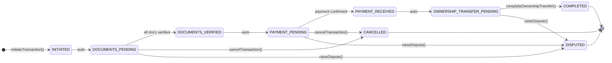
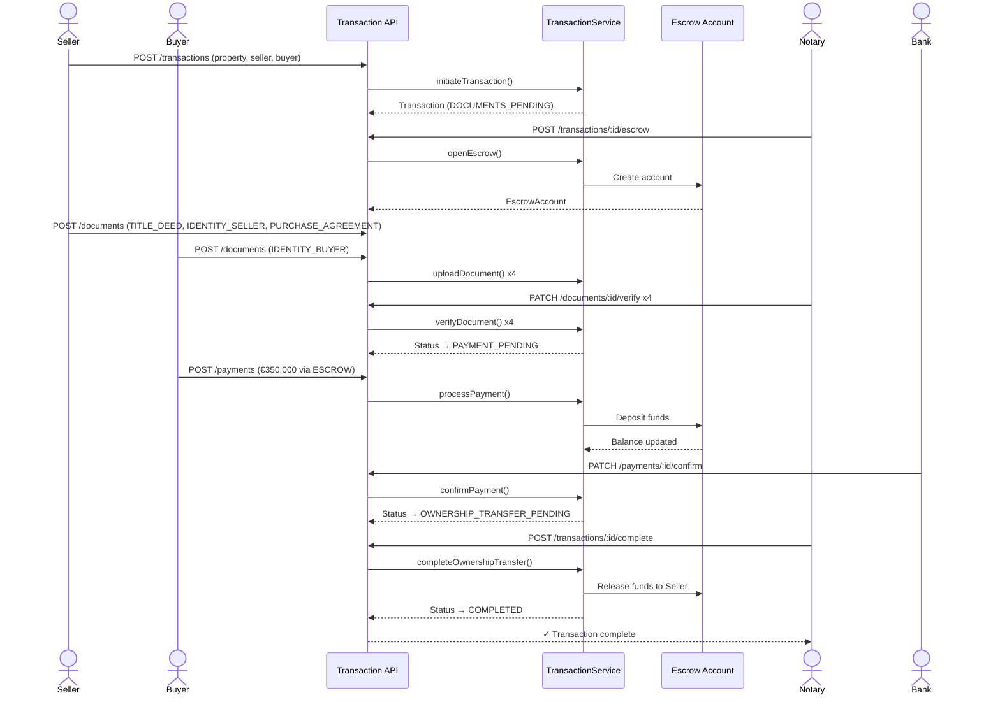
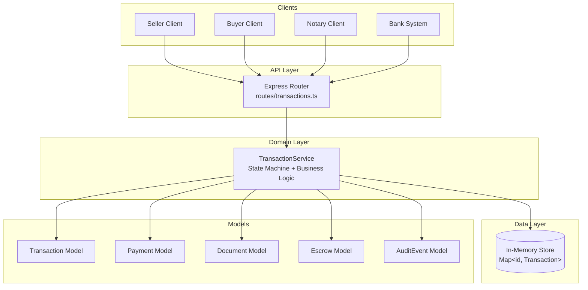
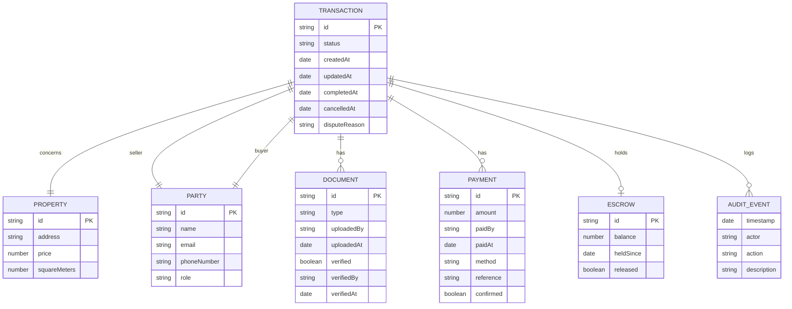

# Architecture: Real Estate Transaction Automation

## Overview

This system automates the **post-agreement** phase of a real estate transaction — everything that happens after a buyer and seller have shaken hands on a deal. The goal is to eliminate manual coordination, reduce fraud risk, and create a tamper-evident audit trail.

---

## The Problem Domain

A real estate transaction involves multiple parties, legal documents, large sums of money, and a final ownership transfer. Without automation, this process is slow, error-prone, and relies on trust between strangers. The key challenges are:

| Challenge      | Solution                                   |
| -------------- | ------------------------------------------ |
| Document fraud | Notary-verified document pipeline          |
| Payment risk   | Escrow account holds funds until transfer  |
| Coordination   | State machine enforces correct ordering    |
| Disputes       | Dispute state + full audit trail           |
| Accountability | Every action logged with actor + timestamp |

---

## State Machine

The transaction lifecycle is modelled as a **finite state machine**. Each state transition is guarded — the service rejects any operation that would violate the correct order.



---

## Sequence Diagram — Happy Path



---

## Component Architecture



---

## Key Design Decisions

### 1. State Machine as the Core Invariant

The `TransactionService` uses an `assertStatus()` guard on every mutating method. This makes it **impossible** to process a payment before documents are verified, or to transfer ownership before payment is confirmed — even if the API is called directly.

### 2. Escrow as a First-Class Concept

Rather than treating payment as a simple flag, the system models an `EscrowAccount` that holds funds. This mirrors how real transactions work: money moves to a neutral third party, then releases to the seller only after the notary signs off.

### 3. Immutable Audit Log

Every state transition and significant action appends an `AuditEvent` to the transaction's `auditLog`. This log is append-only (never mutated), providing a tamper-evident history of who did what and when.

### 4. Separation of Concerns

| Layer                            | Responsibility                           |
| -------------------------------- | ---------------------------------------- |
| `models/Transaction.ts`          | Pure data shapes — no logic              |
| `services/TransactionService.ts` | All business logic and state transitions |
| `routes/transactions.ts`         | HTTP mapping only — delegates to service |
| `demo.ts`                        | End-to-end walkthrough                   |

### 5. Typed Enums for Safety

`DocumentType`, `PaymentMethod`, and `TransactionStatus` are TypeScript enums. This prevents typos and makes the compiler catch invalid values at build time.

---

## Data Model



---

## Production Considerations

In a production system, the following would be added:

| Concern                 | Approach                                              |
| ----------------------- | ----------------------------------------------------- |
| **Persistence**         | PostgreSQL with Prisma ORM; transactions in DB tables |
| **Authentication**      | JWT tokens per party; role-based access control       |
| **Document storage**    | S3-compatible object storage; hash stored in DB       |
| **Payment integration** | Stripe / bank API webhooks for real confirmation      |
| **Notifications**       | Email/SMS via SendGrid/Twilio on each state change    |
| **Smart contracts**     | Ethereum/Solidity for fully trustless escrow          |
| **Audit integrity**     | Append-only event store (EventStoreDB or Kafka)       |
| **Regulatory**          | eIDAS-compliant e-signatures for EU transactions      |

---

## Running the Project

```bash
# Install dependencies
npm install

# Run the colorized CLI demo (recommended first step)
npx tsx src/demo.ts

# Run the REST API server
npm run dev
# → http://localhost:3000
```

## API Reference

| Method  | Path                                            | Description           |
| ------- | ----------------------------------------------- | --------------------- |
| `POST`  | `/api/transactions`                             | Initiate transaction  |
| `GET`   | `/api/transactions`                             | List all transactions |
| `GET`   | `/api/transactions/:id`                         | Get transaction       |
| `GET`   | `/api/transactions/:id/audit`                   | Get audit log         |
| `POST`  | `/api/transactions/:id/escrow`                  | Open escrow           |
| `POST`  | `/api/transactions/:id/documents`               | Upload document       |
| `PATCH` | `/api/transactions/:id/documents/:docId/verify` | Verify document       |
| `POST`  | `/api/transactions/:id/payments`                | Submit payment        |
| `PATCH` | `/api/transactions/:id/payments/:payId/confirm` | Confirm payment       |
| `POST`  | `/api/transactions/:id/complete`                | Complete transfer     |
| `POST`  | `/api/transactions/:id/cancel`                  | Cancel                |
| `POST`  | `/api/transactions/:id/dispute`                 | Raise dispute         |
