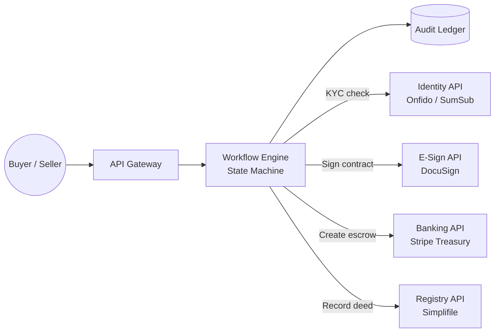

# real-estate-transaction

A TypeScript demo of an automated real estate transaction engine. It models the post-agreement lifecycle — from document collection through escrow, payment, and ownership transfer — using a strict state machine.

## How it works

Every transaction moves through a fixed sequence of states:

```
INITIATED → DOCUMENTS_PENDING → DOCUMENTS_VERIFIED → PAYMENT_PENDING → PAYMENT_RECEIVED → OWNERSHIP_TRANSFER_PENDING → COMPLETED
```

The service layer enforces this — any operation attempted out of order throws immediately. Transactions can also branch into `CANCELLED` or `DISPUTED` states, with dispute resolution returning to `OWNERSHIP_TRANSFER_PENDING`.

## System overview



## Escrow flow

Buyers never send money directly to sellers. A virtual IBAN is created per transaction, funds are held until the deed is recorded, then released automatically.

```
Buyer wires funds → Virtual IBAN → Funds locked → Deed recorded → Payout to seller
```

## Run the demo

```bash
npm install
npm run demo
```

The demo covers four scenarios:

| Scenario         | What it shows                                                 |
| ---------------- | ------------------------------------------------------------- |
| Happy path       | Full lifecycle from initiation to completed transfer          |
| Cancellation     | Mid-process cancellation and blocked follow-up operations     |
| Dispute          | Raising and resolving a dispute, then completing the transfer |
| Edge-case guards | Invalid operations rejected by the state machine              |

## Project structure

```
src/
  models/Transaction.ts      # Domain types and enums
  services/TransactionService.ts  # State machine + business logic
  demo.ts                    # CLI demo runner
  index.ts                   # Express API entry point
```
