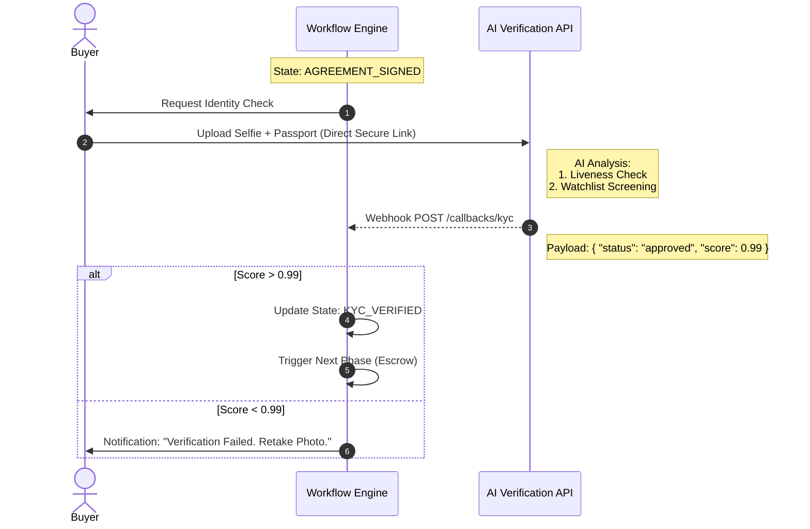
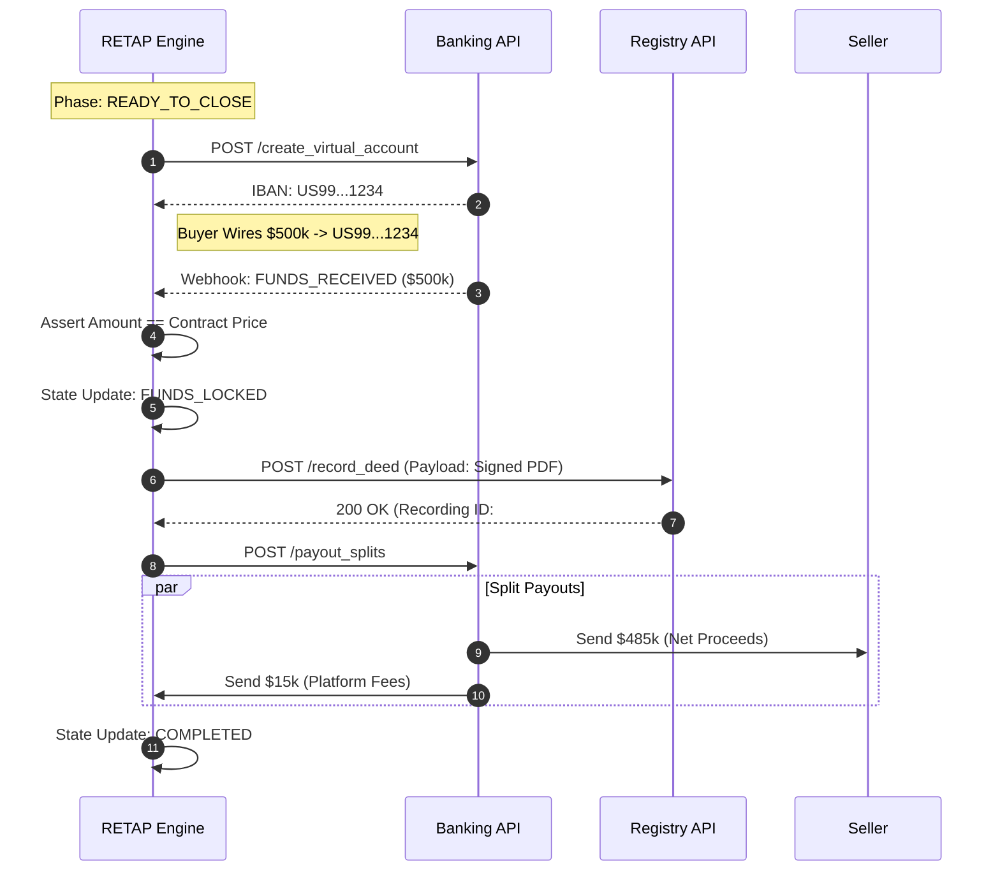

# Real Estate Transaction Automation Platform (RETAP)

## 1. Executive Summary

**RETAP** is a "Zero-Touch" real estate transaction engine designed to automate the lifecycle of a property sale—from the initial agreement to the final deed recording.

Unlike traditional systems that rely on manual administrative review, RETAP utilizes an **Event-Driven Architecture** to orchestrate third-party APIs for Identity Verification (KYC), Digital Escrow (Banking), and Government Recording.

**Key Features:**

- **Deterministic State Machine:** Prevents illegal state transitions (e.g., cannot close without funds).
- **AI Gatekeeper:** Replaces human compliance officers with biometric and document analysis APIs.
- **Digital Escrow:** Uses virtual IBANs to lock funds before ownership transfer.

---

## 2. System Architecture

### 2.1 Master Container Diagram

The system is composed of a central **Workflow Orchestrator** (The Brain) that manages state, and three distinct microservices that handle the heavy lifting for Documents, Money, and Legal Recording.

```mermaid
graph TB
    %% --- Actors ---
    User((👤 User<br/>Buyer/Seller))

    %% --- The Core Platform ---
    subgraph Platform ["🏢 RETAP Automation Platform"]
        style Platform fill:#f0f4f8,stroke:#37474f,stroke-width:2px

        Gateway[("☁️ API Gateway<br/>(Security/Load Balancer)")]

        subgraph Core ["The Brain"]
            style Core fill:#e3f2fd,stroke:#1565c0,stroke-width:2px
            Engine[("🧠 Workflow Engine<br/>(State Machine)")]
            DB[(PostgreSQL<br/>Audit Ledger)]
        end
    end

    %% --- External SaaS Providers (The "Workers") ---
    subgraph SaaS ["🌍 External Automated Services"]
        style SaaS fill:#fff3e0,stroke:#ff6f00,stroke-width:2px

        Identity[("🆔 Identity API<br/>(Onfido/SumSub)")]
        Sign[("✍️ E-Sign API<br/>(DocuSign)")]
        Bank[("💰 Banking API<br/>(Stripe Treasury)")]
        Gov[("🏛️ Registry API<br/>(Simplifile)")]
    end

    %% --- The Flow ---
    User -->|1. Submit Offer| Gateway
    Gateway --> Engine

    %% Phase 1: Agreement
    Engine -->|2. Trigger Contract| Sign
    Sign -.->|Webhook: Signed| Engine

    %% Phase 2: Compliance
    Engine -->|3. Request ID Check| Identity
    Identity -.->|Webhook: Verified (99%)| Engine

    %% Phase 3: Escrow
    Engine -->|4. Create Virtual IBAN| Bank
    Bank -.->|Webhook: Funds Received| Engine

    %% Phase 4: Closing
    Engine -->|5. Record Deed| Gov
    Gov -.->|Webhook: Recorded| Engine

    %% Phase 5: Settlement
    Engine -->|6. Release Payout| Bank
    Engine --> DB
```

---

## 3. Detailed Workflows

### 3.1 The "Zero-Touch" Compliance Gatekeeper

We replace human compliance officers with an AI-driven "Gatekeeper" service. This ensures that no transaction can proceed to the financial phase without verified KYC (Know Your Customer) and AML (Anti-Money Laundering) checks.

**Logic:**

1. User uploads ID/Selfie via secure presigned URL.
2. AI analyzes liveness and document holograms.
3. If `confidence_score > 0.99`, the Gatekeeper automatically approves the milestone.



### 3.2 The Digital Escrow & Settlement

To prevent fraud, buyers never send money directly to sellers.

1. **Virtual Account:** The system creates a unique Virtual IBAN for _this specific transaction_.
2. **The Lock:** Funds are received but "Frozen" in a custodial account.
3. **The Release:** Funds are only released _after_ the Government API confirms the Deed is recorded.



---

## 4. Implementation Details (Node.js Demo)

The core of the system is a **Finite State Machine (FSM)**. This ensures the transaction strictly follows the path:
`DRAFT` → `SIGNED` → `KYC_VERIFIED` → `FUNDS_LOCKED` → `CLOSED`.

### `transactionEngine.ts`

```typescript
import { randomUUID } from "crypto";

// --- 1. The States ---
enum TxState {
  DRAFT = "DRAFT",
  KYC_PENDING = "KYC_PENDING",
  KYC_VERIFIED = "KYC_VERIFIED",
  ESCROW_PENDING = "ESCROW_PENDING",
  FUNDS_LOCKED = "FUNDS_LOCKED", // The critical safety state
  CLOSED = "CLOSED",
}

// --- 2. The Transaction Aggregate ---
class RealEstateTransaction {
  readonly id: string = randomUUID();
  state: TxState = TxState.DRAFT;
  virtualIban?: string;
  auditLog: string[] = [];

  constructor(
    readonly buyerId: string,
    readonly sellerId: string,
    readonly price: number,
  ) {}

  private log(action: string): void {
    const entry = `${new Date().toISOString()}: ${action} [State: ${this.state}]`;
    this.auditLog.push(entry);
    console.log(entry);
  }

  // --- 3. Event Handlers (Webhooks) ---

  onContractSigned(): void {
    if (this.state !== TxState.DRAFT)
      throw new Error("Invalid State Transition");
    this.state = TxState.KYC_PENDING;
    this.log("Contract Signed. Triggering Compliance Check.");
  }

  onKycWebhook(score: number): void {
    if (this.state !== TxState.KYC_PENDING) return; // Ignore duplicate webhooks

    if (score > 0.99) {
      this.state = TxState.KYC_VERIFIED;
      this.log(`Identity Verified (Score: ${score}). Opening Escrow.`);
      this.openVirtualAccount();
    } else {
      this.log(`Identity Failed (Score: ${score}). Manual Review Needed.`);
    }
  }

  private openVirtualAccount(): void {
    this.virtualIban = `US-${randomUUID()}`;
    this.state = TxState.ESCROW_PENDING;
    this.log(`Escrow Account Created: ${this.virtualIban}`);
  }

  onFundsReceivedWebhook(amount: number): void {
    if (this.state !== TxState.ESCROW_PENDING) return;

    if (amount === this.price) {
      this.state = TxState.FUNDS_LOCKED;
      this.log("Funds Secured. Locking Transaction. Proceeding to Recording.");
      this.triggerDeedRecording();
    } else {
      this.log(`ALERT: Incorrect funds received (${amount}). Holding.`);
    }
  }

  private triggerDeedRecording(): void {
    const recordingId = "REC-12345"; // Mock API call to County Recorder
    this.state = TxState.CLOSED;
    this.log(`Deed Recorded (${recordingId}). Releasing Payouts to Seller.`);
  }
}

// --- 4. Simulation Run ---
const tx = new RealEstateTransaction("buyer_1", "seller_1", 500_000);

tx.onContractSigned();
tx.onKycWebhook(0.995); // AI Verification (Zero Touch)
tx.onFundsReceivedWebhook(500_000); // Wire Transfer received

console.log("\n--- Final Audit Trail ---");
tx.auditLog.forEach((entry) => console.log(entry));
```
